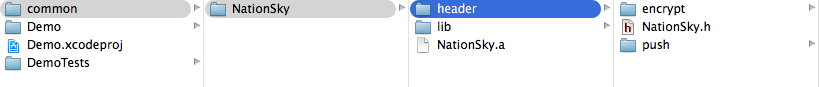
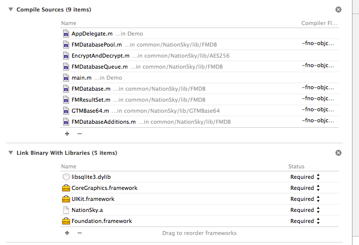
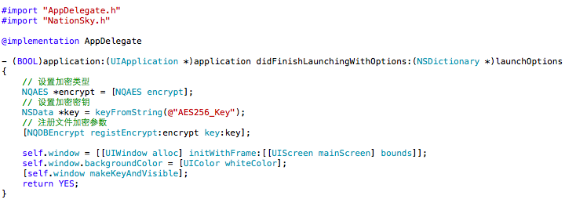

# emm_sdk

emm_sdk是一个通过配置文件自动合成开发所需求的系统

### 目录结构

* script 
	* conf
	* emm_sdk.js
	* README.md
	* resource
	* lib
	* logs
* service_sdk
	* upload_sdk
		* sdk.zip

|   文件夹名称      | 		   描述               |
|-----------------|--------------------------|
|   **script**    |	  存放脚本相关处理数据      |
|     conf        |   存放 sdk 配置文件        |
|	   emm_sdk.js  |   	  `运行脚本`            |
|	    lib        |   存放 emm_sdk.js 依赖文件  |
|	    logs	     |   存放脚本运行日志          |
|	   README.md   |   	  `脚本文档`            |
|	   resource    |   	  脚本文档引用资源包     |
| **service_sdk** |   存放用户上传的 sdk        |
|	  upload_sdk   |   存放用户上传 sdk.zip      |

### 配置文件

#### 为什么需要配置文件

合成sdk前是需要某一个配置文件, 通过配置文件的不同需求, 可以完成不同的sdk集合包.

#### 如何完成配置文件

```
// 配置文件结构
{
	sdk:{
		"sdk_list":[
			{
				sdk_配置信息
			},
			{
				sdk_配置信息
			}
		]
	}
	"output_name": "NQSDK",
	"output_path": "/Users/andy/desktop/output"
}
```

**服务端需要配置文件的那些信息**:   

|		配置字段		 |    字段描述                 |
|----------------|---------------------------|
|   output_name	 |	  sdk输出名称 ( 包括zip, .h )|
|   output_path	 |	  通过脚本合成的zip包输出路径  |


### 如何运行脚本
	
	node script.js config_path
	
**example:**
	
	node emm_sdk.js ~/../script/conf/xxx.json

### 脚本输出文件

脚本运行结束, 输出文件如下:

|	  输出文件    |  文件描述       |       输出文件路径           |
|--------------|----------------|----------------------------|
|   sdk.zip    | sdk的zip开发包  |    output_path/sdk.zip     |
| sdk_time.log |   脚本运行日志   |   script/logs/sdk_time.log |

### 如何使用zip开发包

#### zip开发包目录结构

* sdk
	* header
		* sdk.h
		* header_foler
	* lib
	* sdk.a
	
#### 如何加入项目

**首先, 将sdk直接加入项目**



**然后, 根据sdk文档添加依赖库**



**最后, 引入sdk.h即可使用配置的所注册的所有sdk功能**




